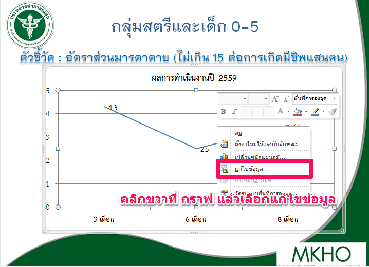
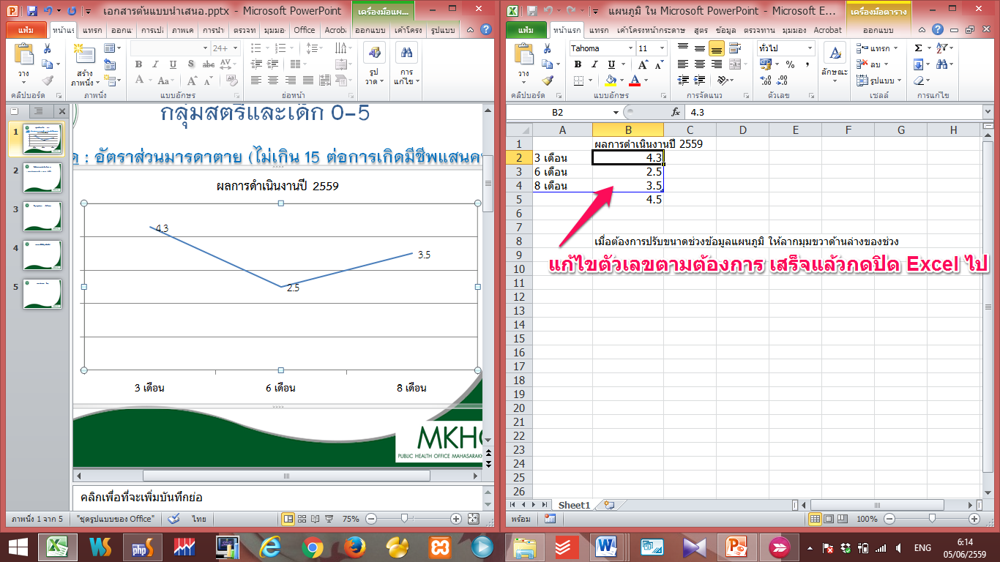
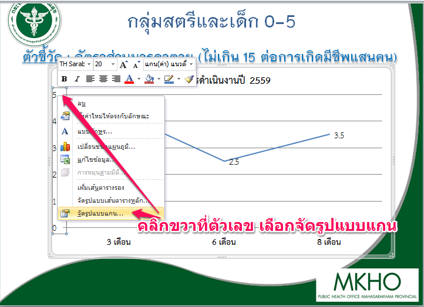

  # การแก้ไข Excel เบื้องต้น
  ##การแก้ไขค่าตัวเลขในกราฟ 
```
คลิกขวาที่กราฟ แล้วเลือก แก้ไขข้อมูล ดังรูป
```
  
  ```
  แล้วจะได้ แผ่นงาน Excel ขึ้นมาทำการแก้ไขตัวเลขได้เลย
  ```
  
  
  ##วิธีการแก้ไขค่าแกน เพื่อกำหนด ตามช่วงที่เราต้องการ
  
  คลิกขวาที่ตัวเลขที่แกน ตัวเลข เพื่อจัดรูปแบบ แล้วคลิกที่ `จัดรูปแบบแกนดังรูป`
  
  
  
  
   